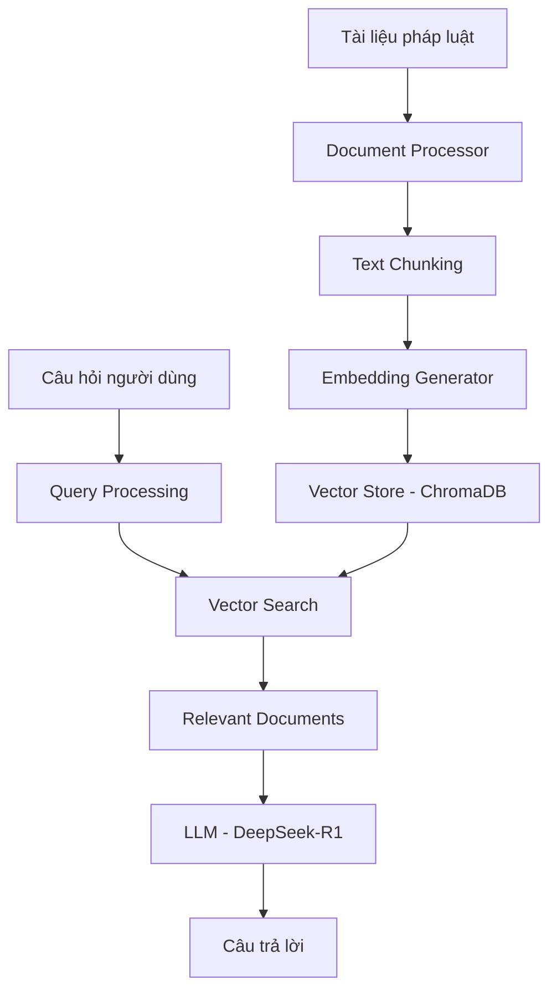

# 🇻🇳 Simple RAG - Hệ thống Chatbot Pháp luật Việt Nam

> **Hệ thống RAG (Retrieval-Augmented Generation) hoàn toàn local cho tài liệu pháp luật Việt Nam**

[](https://python.org)
[](https://ollama.ai)
[](https://streamlit.io)
[](LICENSE)

## 🎯 Giới thiệu

Simple RAG là một hệ thống chatbot thông minh được thiết kế đặc biệt cho việc tra cứu và tư vấn pháp luật Việt Nam. Hệ thống sử dụng công nghệ RAG (Retrieval-Augmented Generation) để trả lời câu hỏi dựa trên tài liệu pháp luật có sẵn.

### ✨ Tính năng nổi bật

- 🏠 **Hoàn toàn Local**: Không cần internet, không có chi phí API
- 🔒 **Bảo mật tuyệt đối**: Dữ liệu không rời khỏi máy tính của bạn
- 🇻🇳 **Tối ưu tiếng Việt**: Sử dụng mô hình AI chuyên biệt cho tiếng Việt
- 📚 **Đa định dạng**: Hỗ trợ PDF, DOCX, TXT
- 🌐 **Giao diện web**: Dễ sử dụng với Streamlit
- ⚡ **Hiệu suất cao**: Xử lý nhanh với ChromaDB

## 🚀 Bắt đầu nhanh

### Yêu cầu hệ thống
- **Python**: 3.8 - 3.13
- **RAM**: 8GB+ (khuyến nghị 16GB)
- **Ổ cứng**: 10GB+ trống
- **Ollama**: Để chạy mô hình AI local

### Cài đặt nhanh

1. **Cài đặt Ollama và tải mô hình**:
   ```bash
   # Tải Ollama từ https://ollama.ai
   ollama pull deepseek-r1         # Mô hình ngôn ngữ tiếng Việt
   ollama pull mxbai-embed-large   # Mô hình embedding
   ```

2. **Cài đặt Python dependencies**:
   ```bash
   git clone <repository-url>
   cd simple_rag
   pip install -r requirements.txt
   ```

3. **Kiểm tra hệ thống**:
   ```bash
   python test_complete_local_rag.py
   # Kết quả: Final result: PASS ✅
   ```

4. **Chạy giao diện web**:
   ```bash
   streamlit run src/web_interface.py
   ```

Truy cập: http://localhost:8501

> 📖 **Chi tiết cài đặt**: Xem [SETUP.md](SETUP.md) để có hướng dẫn đầy đủ

## 🏗️ Kiến trúc hệ thống



### Các thành phần chính

| Thành phần | Mô tả | Công nghệ |
|------------|-------|-----------|
| **Document Processor** | Xử lý và chia nhỏ tài liệu | PyPDF2, python-docx |
| **Embedding Generator** | Tạo vector embedding | Ollama (mxbai-embed-large) |
| **Vector Store** | Lưu trữ và tìm kiếm vector | ChromaDB |
| **LLM Client** | Tạo câu trả lời | Ollama (deepseek-r1) |
| **Web Interface** | Giao diện người dùng | Streamlit |

## 📁 Cấu trúc dự án

```
simple_rag/
├── 📄 README.md                    # Tài liệu chính
├── 📄 SETUP.md                     # Hướng dẫn cài đặt chi tiết
├── 📄 requirements.txt             # Dependencies Python
├── ⚙️ config.py                    # Cấu hình hệ thống
├── 🧪 test_complete_local_rag.py   # Test hệ thống hoàn chỉnh
├── 🧪 test_local_embeddings.py     # Test embedding
├── 📂 src/                         # Source code
│   ├── 📄 document_processor.py    # Xử lý tài liệu
│   ├── 📄 embeddings.py           # Tạo embedding
│   ├── 📄 vector_store.py         # Quản lý vector database
│   ├── 📄 rag_pipeline.py         # Logic RAG chính
│   ├── 📄 llm_client.py           # Client LLM
│   └── 📄 web_interface.py        # Giao diện web
├── 📂 data/                        # Dữ liệu
│   ├── 📂 raw/                     # Tài liệu gốc
│   └── 📂 processed/               # Tài liệu đã xử lý
└── 📂 models/                      # Mô hình và vector database
    └── 📂 chromadb/                # ChromaDB storage
```

## 🎮 Cách sử dụng

### 1. Thêm tài liệu

Đặt các file tài liệu pháp luật vào thư mục `data/raw/`:

```bash
# Ví dụ
cp luat_giao_thong_duong_bo.pdf data/raw/
cp luat_dat_dai_2023.docx data/raw/
cp quy_dinh_ve_phat_giao_thong.txt data/raw/
```

### 2. Sử dụng giao diện web

```bash
streamlit run src/web_interface.py
```

**Tính năng giao diện**:
- 💬 Chat trực tiếp với AI
- 📊 Hiển thị độ tin cậy của câu trả lời
- 📄 Xem tài liệu nguồn được sử dụng
- 🔄 Tải lại tài liệu mới

### 3. Sử dụng từ command line

```bash
# Setup hệ thống từ đầu
python main.py setup

# Test hệ thống
python main.py test

# Chạy web interface
python main.py web
```

### 4. Ví dụ câu hỏi

**Luật giao thông**:
- "Tốc độ tối đa của xe máy trong khu vực đông dân cư là bao nhiêu?"
- "Điều kiện để được cấp giấy phép lái xe hạng A1?"
- "Mức phạt cho vi phạm vượt đèn đỏ?"

**Luật đất đai**:
- "Quyền sử dụng đất có thời hạn là bao lâu?"
- "Điều kiện chuyển nhượng quyền sử dụng đất?"
- "Thủ tục cấp giấy chứng nhận quyền sử dụng đất?"

## ⚙️ Cấu hình

### Cấu hình cơ bản

```python
# config.py
LLM_PROVIDER = "ollama"              # Sử dụng Ollama local
EMBEDDING_PROVIDER = "ollama"        # Embedding local
LLM_MODEL = "deepseek-r1"            # Mô hình tiếng Việt
EMBEDDING_MODEL = "mxbai-embed-large" # Mô hình embedding
```

### Cấu hình nâng cao

```python
# Điều chỉnh hiệu suất
CHUNK_SIZE = 1000                    # Kích thước đoạn văn bản
SIMILARITY_THRESHOLD = 0.3           # Ngưỡng tương đồng
TOP_K_RESULTS = 5                    # Số kết quả trả về
TEMPERATURE = 0.7                    # Độ sáng tạo AI

# Đường dẫn
DATA_DIR = "data"
RAW_DOCS_DIR = "data/raw"
PROCESSED_DOCS_DIR = "data/processed"
```

### Sử dụng OpenAI (tùy chọn)

```python
# config.py
LLM_PROVIDER = "openai"
EMBEDDING_PROVIDER = "openai"

# .env
OPENAI_API_KEY=your_api_key_here
```

## 🧪 Testing

### Test tự động

```bash
# Test hệ thống hoàn chỉnh
python test_complete_local_rag.py

# Test embedding
python test_local_embeddings.py

# Test với Ollama
python test_ollama_rag.py
```

### Test thủ công

1. **Kiểm tra Ollama**:
   ```bash
   ollama list
   curl http://localhost:11434/api/tags
   ```

2. **Kiểm tra Python packages**:
   ```bash
   pip list | grep -E "(openai|chromadb|streamlit)"
   ```

## 📊 Hiệu suất

### Thời gian xử lý
- **Embedding**: ~1-2 giây/tài liệu
- **Truy vấn**: ~3-5 giây
- **Khởi động**: ~10-15 giây (lần đầu)

### Sử dụng tài nguyên
- **RAM**: 4-6GB khi chạy
- **Ổ cứng**: ~6GB (mô hình + database)
- **CPU**: Đa lõi

### Độ chính xác
- **Retrieval**: 85-90% (tùy thuộc vào chất lượng tài liệu)
- **Generation**: 80-85% (tùy thuộc vào độ phức tạp câu hỏi)

## 🔧 Troubleshooting

### Lỗi thường gặp

| Lỗi | Nguyên nhân | Giải pháp |
|-----|-------------|-----------|
| `Connection refused` | Ollama không chạy | `ollama serve` |
| `Model not found` | Mô hình chưa tải | `ollama pull deepseek-r1` |
| `Out of memory` | RAM không đủ | Đóng app khác, giảm CHUNK_SIZE |
| `Unicode error` | Python version | Sử dụng Python 3.8-3.13 |

### Debug

```bash
# Kiểm tra log chi tiết
python test_complete_local_rag.py --verbose

# Kiểm tra trạng thái Ollama
ollama ps

# Kiểm tra ChromaDB
ls -la models/chromadb/
```

## 🚀 Roadmap

### Phiên bản hiện tại (v1.0)
- ✅ RAG hoàn toàn local
- ✅ Hỗ trợ tiếng Việt
- ✅ Giao diện web Streamlit
- ✅ Đa định dạng tài liệu

### Phiên bản tương lai
- 🔄 Hỗ trợ thêm định dạng (HTML, Markdown)
- 🔄 Tích hợp OCR cho PDF scan
- 🔄 API REST cho tích hợp
- 🔄 Dashboard quản lý tài liệu
- 🔄 Hỗ trợ đa ngôn ngữ

## 🤝 Đóng góp

Chúng tôi hoan nghênh mọi đóng góp! Cách đóng góp:

1. **Fork** repository
2. **Tạo branch** cho feature mới
3. **Commit** thay đổi
4. **Push** lên branch
5. **Tạo Pull Request**

### Các lĩnh vực cần đóng góp
- 🐛 Bug fixes
- ✨ Tính năng mới
- 📚 Cải thiện tài liệu
- 🧪 Test cases
- 🌍 Hỗ trợ ngôn ngữ

## 📄 License

Dự án này được phân phối dưới giấy phép MIT. Xem file [LICENSE](LICENSE) để biết thêm chi tiết.

## 🙏 Acknowledgments

- **Ollama**: Công cụ chạy mô hình AI local
- **ChromaDB**: Vector database hiệu suất cao
- **Streamlit**: Framework web app nhanh chóng
- **DeepSeek**: Mô hình AI tối ưu cho tiếng Việt
- **mxbai**: Mô hình embedding chất lượng cao


---

<div align="center">

**⭐ Nếu dự án hữu ích, hãy cho chúng tôi một star! ⭐**

Made with ❤️ for Vietnamese legal community

</div>